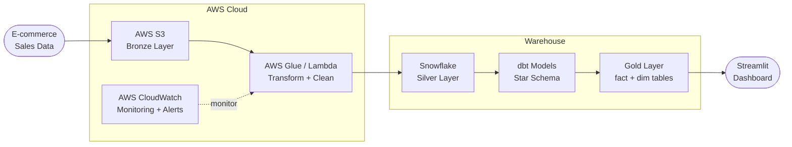

# AWS Cloud Data Pipeline

A cloud-native ELT pipeline on AWS that ingests e-commerce sales data, transforms it through a medallion architecture, and models it into a star schema using dbt and Snowflake — with a Streamlit analytics dashboard.

---

## Architecture



---

## Tech Stack

| Layer | Technology |
|---|---|
| Storage (Bronze) | AWS S3 |
| Transform | AWS Glue / Lambda (Python) |
| Warehouse (Silver/Gold) | Snowflake |
| Modeling | dbt (dbt-snowflake adapter) |
| Orchestration | Apache Airflow / AWS EventBridge |
| Dashboard | Streamlit |
| Monitoring | AWS CloudWatch |
| DevOps | GitHub Actions CI/CD |

---

## Star Schema Design

```
fact_sales
├── sale_id (PK)
├── date_key (FK → dim_date)
├── product_key (FK → dim_product)
├── customer_key (FK → dim_customer)
├── location_key (FK → dim_location)
├── quantity
├── unit_price
├── discount
└── total_amount

dim_date          dim_product       dim_customer      dim_location
├── date_key      ├── product_key   ├── customer_key  ├── location_key
├── date          ├── product_name  ├── customer_name ├── city
├── day           ├── category      ├── email         ├── state
├── month         ├── subcategory   ├── segment       ├── country
├── quarter       ├── brand         └── join_date     └── region
├── year          └── unit_cost
└── is_weekend
```

---

## Project Structure

```
aws-cloud-data-pipeline/
├── src/
│   ├── ingest/
│   │   └── upload_to_s3.py        # Upload raw CSV to S3 Bronze
│   ├── transform/
│   │   ├── glue_job.py            # AWS Glue ETL script
│   │   └── lambda_handler.py      # Lambda trigger on S3 event
│   └── load/
│       └── snowflake_loader.py    # Load to Snowflake Silver
├── dbt/
│   ├── models/
│   │   ├── staging/
│   │   │   └── stg_sales.sql      # Normalize raw sales
│   │   └── gold/
│   │       ├── fact_sales.sql     # Fact table
│   │       ├── dim_date.sql       # Date dimension
│   │       ├── dim_product.sql    # Product dimension
│   │       ├── dim_customer.sql   # Customer dimension
│   │       └── dim_location.sql   # Location dimension
│   ├── dbt_project.yml
│   └── profiles.yml
├── dashboard/
│   └── app.py                     # Streamlit analytics dashboard
├── data/
│   └── sample/                    # Sample e-commerce CSV
├── .github/
│   └── workflows/
│       └── dbt_ci.yml             # dbt test on every PR
├── docker-compose.yaml
├── requirements.txt
└── README.md
```

---

## dbt Models

| Model | Type | Description |
|---|---|---|
| `stg_sales` | View | Normalize raw CSV from Snowflake stage |
| `fact_sales` | Table | Core transaction facts |
| `dim_date` | Table | Date dimension with fiscal periods |
| `dim_product` | Table | Product hierarchy and categories |
| `dim_customer` | Table | Customer segments |
| `dim_location` | Table | Geographic hierarchy |

---

## Dashboard Metrics

- **Total Revenue** — by month, quarter, year
- **Top Products** — by revenue and units sold
- **Customer Segments** — revenue breakdown by segment
- **Regional Performance** — sales by state/region
- **Discount Impact** — correlation between discount and revenue
- **YoY Growth** — year-over-year comparison

---

## Pipeline Flow

```
1. Raw e-commerce CSV uploaded to AWS S3 (Bronze)
2. AWS Lambda triggers on S3 event → runs Glue job
3. Glue cleans + normalizes data → loads to Snowflake Silver
4. dbt runs star schema models → Gold layer (fact + dims)
5. dbt tests validate data quality
6. Streamlit dashboard reads from Snowflake Gold
7. CloudWatch monitors pipeline health + sends alerts
```

---

## Setup

```bash
git clone https://github.com/Smriti4252/aws-cloud-data-pipeline.git
cd aws-cloud-data-pipeline
python -m venv .venv
.venv\Scripts\activate   # Windows
pip install -r requirements.txt

# Configure credentials
cp .env.example .env
# Edit .env with:
# AWS_ACCESS_KEY_ID, AWS_SECRET_ACCESS_KEY
# SNOWFLAKE_ACCOUNT, SNOWFLAKE_USER, SNOWFLAKE_PASSWORD
```

---

## Status

🚧 **In Progress** — AWS infrastructure and dbt star schema being implemented.

---

## Author

**Smriti Sharma** — Data Engineer | AI Engineer  
[LinkedIn](https://www.linkedin.com/in/smritisharma731/) · [GitHub](https://github.com/Smriti4252)
