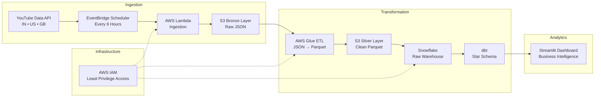

# 🎯 YouTube Analytics Lakehouse

A production-style cloud data pipeline that automatically collects YouTube trending data, processes it through a Medallion Architecture, models it into a dimensional warehouse, and exposes business intelligence through an interactive dashboard.

---

## 🏗️ Architecture



---

## 🛠️ Tech Stack

| Layer           | Technology                      |
| --------------- | ------------------------------- |
| Ingestion       | AWS Lambda, YouTube Data API v3 |
| Orchestration   | AWS EventBridge Scheduler       |
| Storage         | AWS S3 (Bronze + Silver)        |
| Transformation  | AWS Glue (PySpark)              |
| Data Warehouse  | Snowflake                       |
| Data Modeling   | dbt (Star Schema)               |
| Dashboard       | Streamlit + Plotly              |
| Infrastructure  | AWS IAM                         |
| Version Control | GitHub                          |

---

## 📐 Medallion Architecture

### Bronze Layer

Raw JSON responses from the YouTube API are stored exactly as received without any transformations. Data is partitioned by ingestion timestamp to simplify reprocessing and historical analysis.

### Silver Layer

AWS Glue ETL jobs clean, standardize, and convert raw JSON into optimized Parquet files.

Transformations include:

* Schema normalization
* Type casting (`viewCount`, `likeCount`, `commentCount` → LONG)
* Deduplication using `video_id + region_code + ingested_at`
* Null filtering
* Standardized column naming

### Gold Layer — Snowflake + dbt

Business-ready dimensional models are built using dbt following a Star Schema approach.

```text
fact_video_metrics
├── dim_channel
├── dim_category
├── dim_date
└── dim_region
```

The fact table captures the performance of a video within a specific region at a particular ingestion timestamp.

---

## 📊 Dashboard — Business Intelligence

The Streamlit dashboard answers real content strategy questions:

* **Niche Intelligence** — Which content categories receive the highest views versus engagement?
* **Best Time to Post** — Which day and hour maximize reach?
* **Cross-Region Opportunity** — Which videos trend across multiple regions simultaneously?
* **Creator Intelligence** — Which channels consistently appear in trending lists?
* **Category Momentum** — Which categories are growing fastest over time?
* **Regional Preferences** — How does audience behavior differ between countries?

---

## 🧪 Data Quality

dbt tests implemented:

* `not_null` — `video_id`, `region_code`
* `accepted_values` — `region_code` in `['IN', 'US', 'GB']`
* `unique_combination` — `video_id + region_code + ingested_at`

---

## 📁 Repository Structure

```text
aws-cloud-data-pipeline/
├── ingestion/
│   └── lambda/
│       └── handler.py
├── glue/
│   └── jobs/
│       └── bronze_to_silver.py
├── dbt/
│   └── youtube_analytics/
│       ├── models/
│       │   ├── staging/
│       │   └── marts/
│       └── packages.yml
├── streamlit/
│   └── app.py
├── infrastructure/
│   └── snowflake/
│       └── setup.sql
└── .github/
    └── workflows/
```

---

## 🚀 Pipeline Flow

1. **EventBridge Scheduler** triggers the ingestion process every 6 hours.
2. **AWS Lambda** fetches the top 50 trending videos from India, United States, and United Kingdom using the YouTube Data API.
3. Raw JSON responses are stored in the **S3 Bronze Layer** using timestamp-based partitions.
4. **AWS Glue ETL** reads Bronze data, applies transformations, and writes optimized Parquet files to the **S3 Silver Layer**.
5. **Snowflake COPY INTO** loads Silver Parquet files into warehouse tables.
6. **dbt run** builds dimensional models and business-ready marts.
7. **Streamlit** queries Snowflake models to power the analytics dashboard.

---

## 📈 Data Volume

* 150 videos collected per pipeline execution
* 50 videos per region across IN, US, and GB
* Pipeline runs every 6 hours
* 4 ingestion cycles per day
* 600 records generated daily
* 1,900+ historical video-region snapshots currently available for analysis

---

## 🌍 Regions Covered

| Region         | Code |
| -------------- | ---- |
| India          | IN   |
| United States  | US   |
| United Kingdom | GB   |

---

## 🎯 Project Goals

This project was built to simulate a real-world cloud analytics platform using modern data engineering practices.

The pipeline demonstrates:

* Event-driven ingestion
* Lakehouse architecture
* Batch ETL processing with PySpark
* Dimensional modeling with dbt
* Data quality testing
* Cloud-native analytics delivery

The objective was to build an end-to-end system that covers the complete data lifecycle from ingestion to business intelligence reporting.
